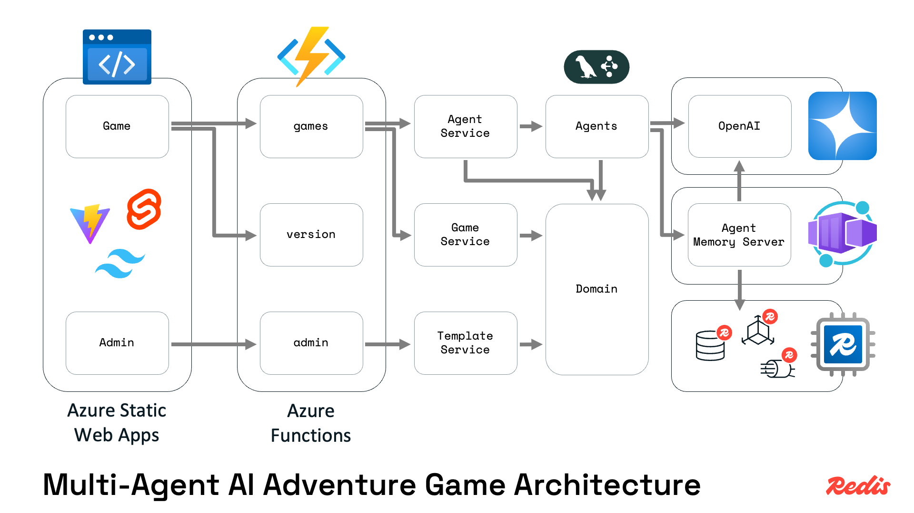
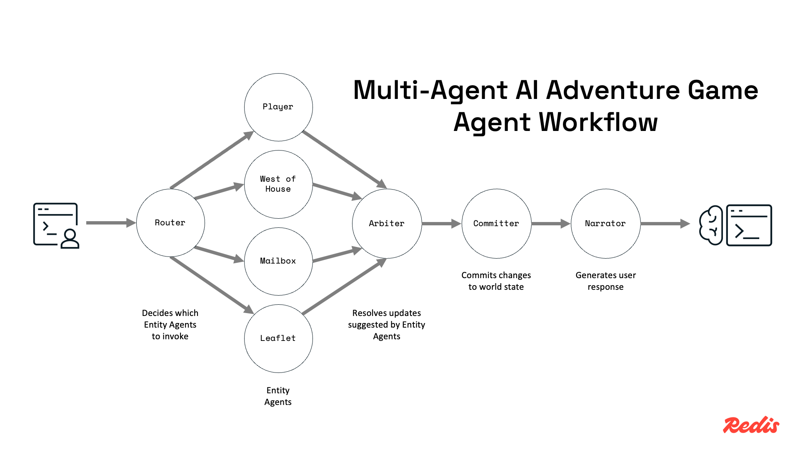
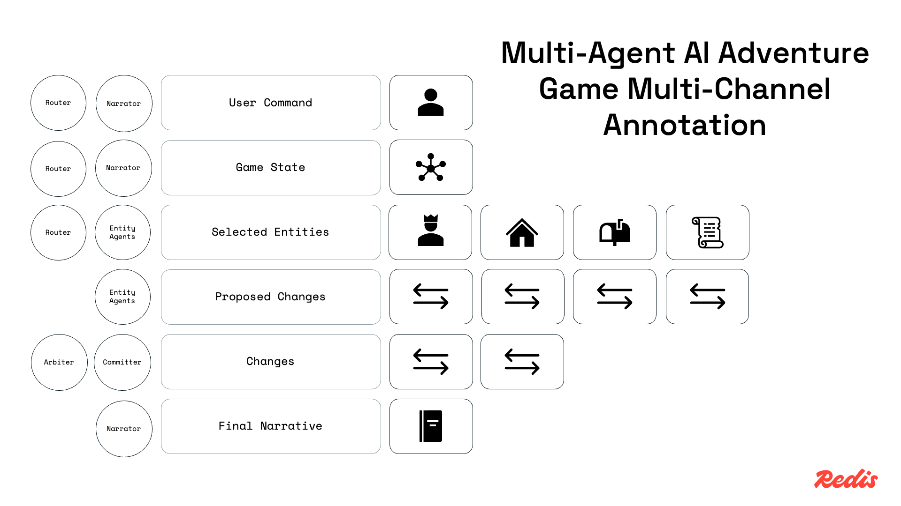

# Multi-Agent AI Text Adventure Game

## Overview

This multi-agent AI text adventure game—inspired by [Zork](https://en.wikipedia.org/wiki/Zork) and affectionately called _Agents & Arbiters_—demonstrates how to implement a multi-agent system with multi-channel state using LangChain's [LangGraph.js](https://github.com/langchain-ai/langgraphjs). Built on Azure using Static Web Apps, Azure Functions, Azure Manager Redis, and Azure OpenAI, this demo showcases Redis' ability to store workflow state and manage short- and long-term conversation context using [Agent Memory Server](https://redis.github.io/agent-memory-server/).

## Table of Contents

- [Demo Objectives](#demo-objectives)
- [Setup](#setup)
- [Running the Demo](#running-the-demo)
- [Slide Decks](#slide-decks)
- [Architecture](#architecture)
- [Known Issues](#known-issues)
- [Resources](#resources)
- [Maintainers](#maintainers)
- [License](#license)

## Demo Objectives

- Show how to build a multi-agent system with multi-channel state using [LangGraph.js](https://github.com/langchain-ai/langgraphjs).
- Demonstrate the usage of [Azure Managed Redis](https://azure.microsoft.com/en-us/products/managed-redis/)'s JSON and search capabilities to store and query persistent state for AI workflows.
- Highlight [Redis Agent Memory Server](https://redis.github.io/agent-memory-server/) as a tool to manage short-term memory for AI workflows.

## Setup

### Dependencies

**For Local Development:**

- [Node.js](https://nodejs.org/) v22+
- [Docker](https://www.docker.com/) for local Redis, AMS, and LiteLLM
- [OpenAI API Key](https://platform.openai.com/api-keys)

**For Azure Deployment:**

- [Azure](https://portal.azure.com/) subscription
- [Azure CLI](https://learn.microsoft.com/cli/azure/install-azure-cli)
- [Azure Developer CLI](https://learn.microsoft.com/azure/developer/azure-developer-cli/install-azd)

### Configuration

**Local Configuration:**

Copy `.env.example` to `.env` and fill in your OpenAI API key.

```bash
cp .env.example .env
```

If you use Node Version Manager run:

```bash
nvm use
```

Install Node.js dependencies:

```bash
npm install
```

**Azure Configuration:**

No configuration necessary.

## Running the Demo

**Running Locally:**

In one terminal window start the Docker services for Redis, Agent Memory Server, and LiteLLM:

```bash
docker compose up
```

In another terminal window, start the development servers:

```bash
npm run dev
```

This will compile and start the application. Now, just navigate to [http://localhost:4280](http://localhost:4280) in your browser and start playing the game.

**Running on Azure:**

```bash
azd up
```

Navigate to the URL provided by the `azd up` command in your browser and start playing the game.

### Using the Demo

When you launch the game you will be presented with options for a _New Game_, _Load Game_, and _Load World Template_.

If it is your first time running the game you will need to load a world template before you can play. There are some AI-generated templates to choose from in the [templates directory](./templates) in this repository. Click _Load World Template_ and choose one that sounds interesting to you.

Once the template is loaded you can start a new game. Click _New Game_ and give your game a name or keep the randomly generated one. Ask the game 'Where am I?' and it'll tell you. From there, just start typing commands to explore the world.

You can also load a saved game by clicking _Load Game_ and selecting a game from the list. Games are saved automatically as you play. No need to save manually.

You can view the game log by clicking _Log_ in the top right of the game screen. This will show you the underlying workflow and all the LLM calls. Click _Terminal_ to go back to the game.

When you're done playing, just close the window. If you're running locally, your game data will be preserved in Redis. If you're running on Azure, your game data is stored in Azure Managed Redis and will be preserved unless you delete the resources.

### Stopping the Demo

**Running Locally:**

Just hit `Ctrl+C` in the terminal windows where you ran `npm run dev` and `docker compose up` respectively.

**Running on Azure:**

```bash
azd down --purge
```

Note that this will delete all resources, including the Redis database. All data will be lost.

## Slide Decks

📁 [Multi-Agent AI Text Adventure Game Slides](./slides/multi-agent-ai-text-adventure-game-presentation.pdf)  
Covers goals, the agent workflow and architecture, and key Redis features. Suitable for formal presentations.

📁 [Agents & Arbiters Slides](./slides/agents-n-arbiters-presentation.pdf)  
Covers the game design, an introduction to LangGraph.js, patterns of multi-agent workflows, multi-channel annotations, and how Redis fits in. Suitable for usage at a developer conference.

## Architecture



The Svelte 5 + Tailwind CSS frontend is hosted on Azure Static Web Apps and sends user requests to a collection of Azure Functions written in TypeScript. These functions use Redis to store game state, Agent Memory Server to manage conversation context, and Azure OpenAI as the LLM provider. The agent workflow itself is implemented using LangGraph.js.



The agent workflow shows the router handling the initial user command and routing to the appropriate agents based on the command. The arbiter then reviews the agent responses and makes a final decision on how to proceed. Finally, the committer applies the changes to the game state and the narrator generates the final response.



The custom annotation is a key feature of LangGraph.js that allows you to define the structure of the state and how it flows between nodes in the graph. In this example, the custom annotation defines the structure of the game state and how it is updated by each node in the graph.

## Known Issues

- Redis Agent Memory Server is only integrated with the narrator agent. This means that conversation history is not available to other agents in the workflow who might need them. Not a bug, but a limitation of the current implementation. A better approach would be to load the conversation from Agent Memory Server at the start of the workflow and then store it in the custom annotation.

## Resources

- [Azure Managed Redis](https://azure.microsoft.com/en-us/products/managed-redis/)
- [LangGraph.js](https://github.com/langchain-ai/langgraphjs)
- [LangGraph's Multi-Agent Collaboration Documentation](https://langchain-ai.github.io/langgraph/tutorials/multi_agent/multi-agent-collaboration/).
- [Redis Agent Memory Server](https://redis.github.io/agent-memory-server/)
- [Redis' JSON Documentation](https://redis.io/docs/latest/develop/data-types/json/)

## Maintainers

**Maintainers:**

- Guy Royse — [guyroyse](https://github.com/guyroyse)

## License

This project is licensed under the [MIT License](./LICENSE).
